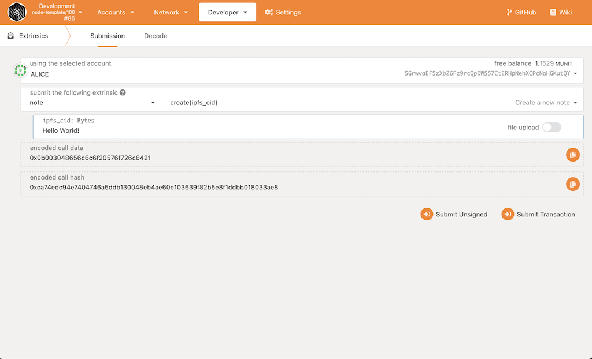
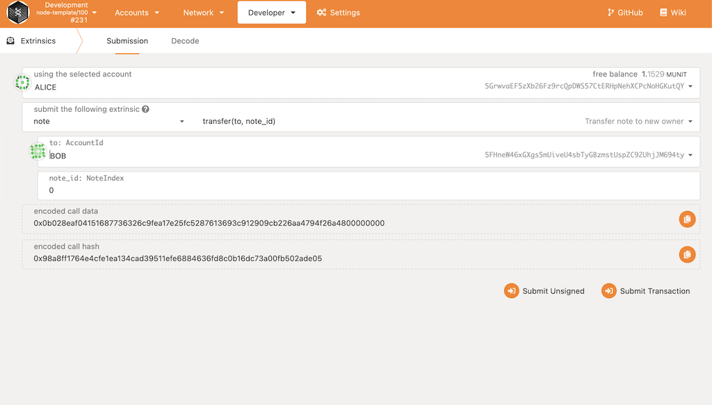
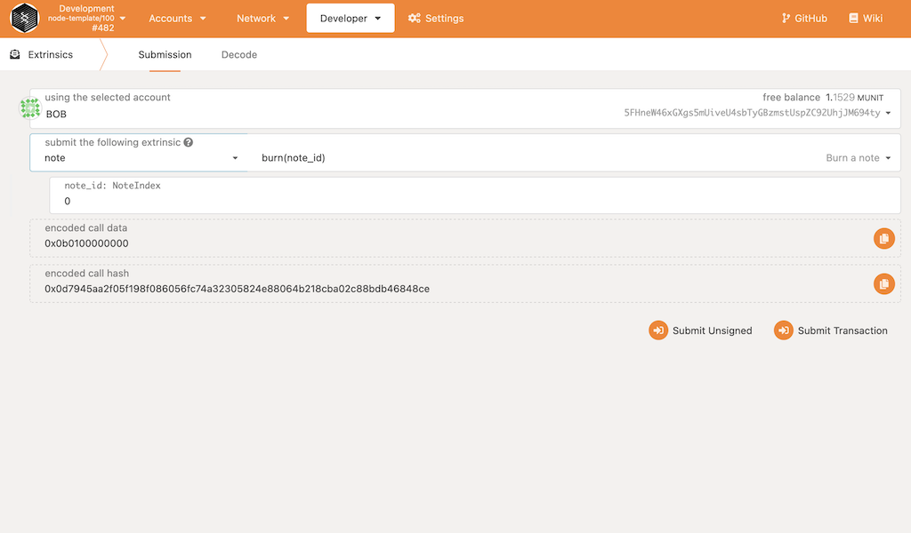
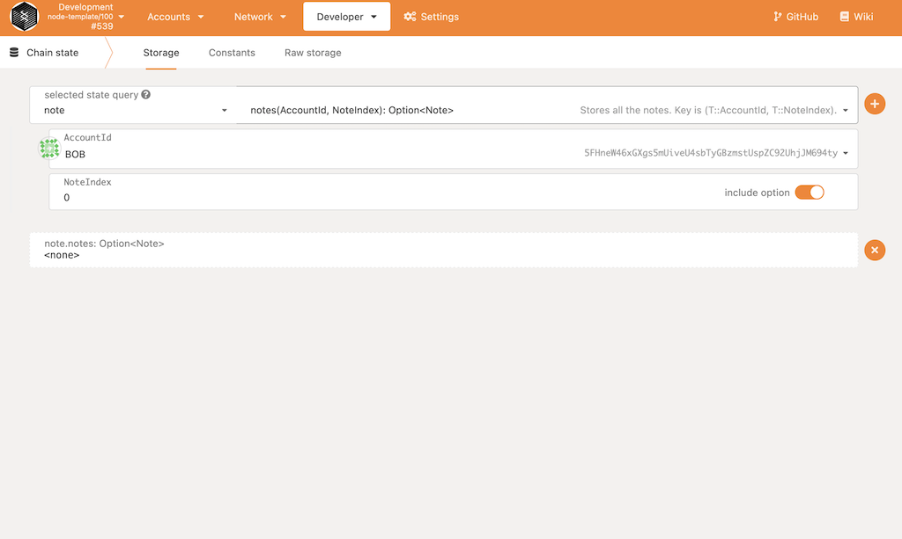
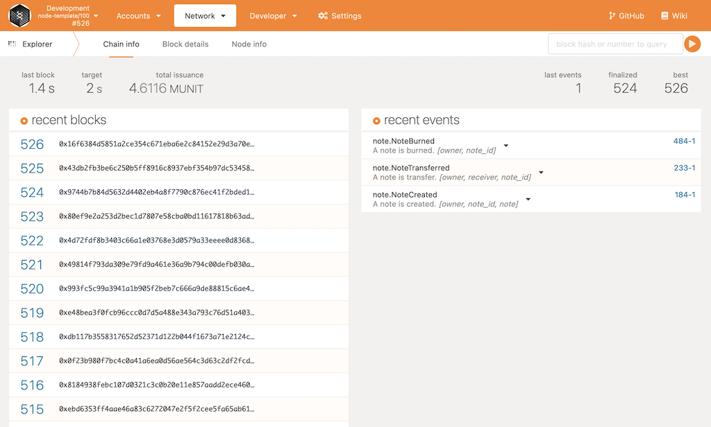

## Git Clone and Compile YibanChen Substrate Node
---
First, follow the [Rust Setup](./rust-setup.md).

Then run the following command to git clone the node source code.

```bash
git clone https://github.com/YibanChen/YibanChen-node
```

Next you can run the following command to run the unit tests.

```bash
cd YibanChen-node && cargo test --release
```

Next you can run the following command to build and run the node.

```bash
cargo run --release -- --tmp --dev --ws-external --unsafe-ws-external --rpc-cors=all
```

## Interacting on Polkadot.js.org
---
You can access your local running node here: [Polkadot.js Local Node](https://polkadot.js.org/apps/?rpc=ws%3A%2F%2F127.0.0.1%3A9944)

### STEP 0
>Before we begin, there are some types that need to be added to the polkadot.js app. You can enter these types under `Settings -> Developer`

```
{
  "ClassId": "u32",
  "ClassIdOf": "ClassId",
  "TokenId": "u64",
  "TokenIdOf": "TokenId",
  "TokenInfoOf": {
    "metadata": "CID",
    "owner": "AccountId",
    "data": "TokenData"
  },
  "ClassInfoOf": {
    "metadata": "string",
    "totalIssuance": "string",
    "owner": "string",
    "data": "string"
  },
  "Note": "Text",
  "NoteIndex": "u32"
}
```
### STEP 1 - Create a Note
Once here, visit `Developer -> Extrinsics` tab. Here you can select `Alice` as your selected account

Select the `note` module and the `create` method as shown below.
Enter a IPFS hash or a string of text into the ipfs_cid field.
After entering some data, submit the transaction.
<p align="center">
  
</p>

### STEP 2 - Transfer a Note
Select the `transfer` method. Select "to" account `Bob`. Then submit the transaction. This will transfer the newly created note to `Bob`.
<p align="center">
  
</p>


### STEP 3 - Read a Note
Next go to the `Developer -> Chain state` tab, select `note` for the state query. Select AccountId `Bob` and note_id `0`. This will display the note that we created and the contained information.
<p align="center">
  
</p>

### STEP 4 - Burn a Note
Now go back to the `Developer -> Extrinsics` tab. Here you can select `Bob` as your selected account
Select the `note` module and the `burn` method as shown below. Then submit the transaction.
<p align="center">
  
</p>

You can now go to `Developer -> Chain state` tab and you will see under `note` storage that the note is now set to none.
<p align="center">
  
</p>


### STEP 5
Now we can go to `Network -> Explorer` tab and see under `recent events` that our create, transfer and burn was successful.

<p align="center">
  
</p>
